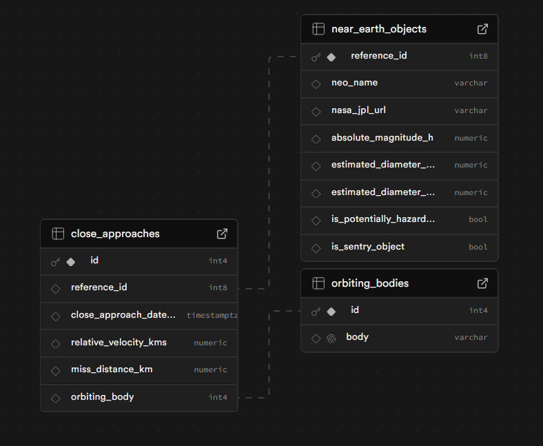

# Automated NASA Near-Earth Objects (NEO) Pipeline

A fully automated ETL pipeline, starting from the ingestion of NEO data from the NASA NeoWs API, cleaning and transforming the collected data, to storing the cleaned data and optimizing queries through indexing.

### Features:

- **Serverless Architecture:** A fully automated ETL pipeline using **AWS Lambda** and **EventBridge**, reducing infrastructure overhead while maintaining daily ingestion of near-earth objects (NEO) data from the NASA NeoWs API.
- **Cloud Deployment:** Streamlined deployment by packaging custom **AWS Lambda Layers** with **manylinux-compatible** binaries (Pandas/Psycopg2), ensuring cross-platform stability between Windows development and Linux production environments.
- **Data Persistence:** Stores raw data to **Amazon S3**, and the cleaned data to **PostgreSQL**
- **Data Processing:** Used **pandas** to normalize complex nested JSON structures, standardizing multi-unit measurements and engineering features to calculate asteroid hazard metrics.
- **Optimization:** Improved query performance for historical approach tracking by implementing indexing on time-series columns, enabling near-instant retrieval of hazardous object trajectories.

### Technologies/Libraries Used:

- Python (3.12)
- pandas
- requests
- PostgreSQL
- AWS (Lambda, S3, Amazon EventBridge)
- Jupyter (for testing)

### Schema



### Testing Instructions

1. Clone this repository
2. Create a virtual environment with the command `python -m venv venv` and activate the environment.
3. Install dependencies `pip install -r requirements.txt`
4. Create a `.env` file with the following variables:

```
NASA_API_KEY=your_api_key

DB_URL=your_postgres_server_url # can be empty, you can specify the ones below instead
DB_NAME=your_db_name
DB_USER=your_db_username
DB_PASSWORD=your_db_password
DB_HOST=localhost
DB_PORT=5432
DB_SCHEMA=nasa_neows # can be empty

AWS_ACCESS_KEY=your_access_key
AWS_SECRET_KEY=your_secret_key
AWS_REGION=us-east-1
AWS_BUCKET_NAME=your_bucket_name
```

5. Test the pipeline by running `etl.ipynb`
6. The `lambda_function.py` file is already provided if you want to deploy it in Lambda. If so, also modify `constants.py` to use the commands for using the environment variables from the AWS console instead, or just include your `.env` file when uploading your files in Lambda.
